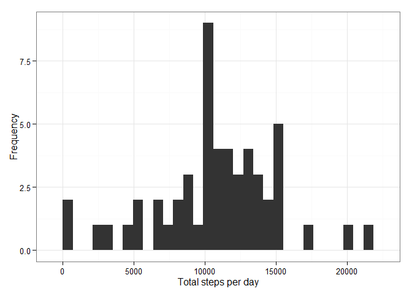
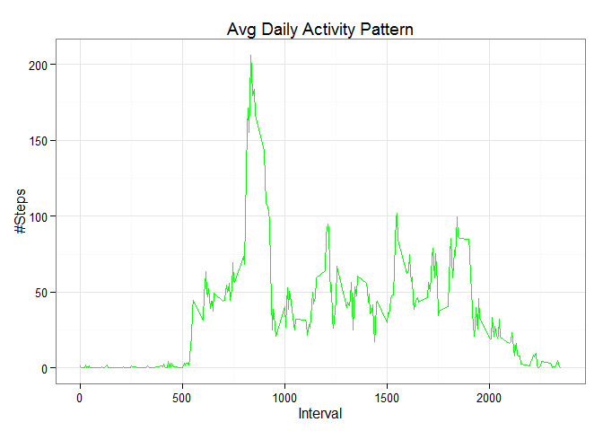
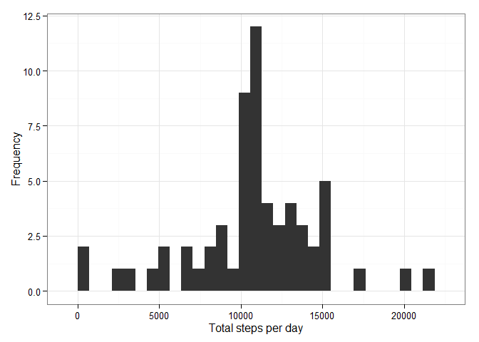
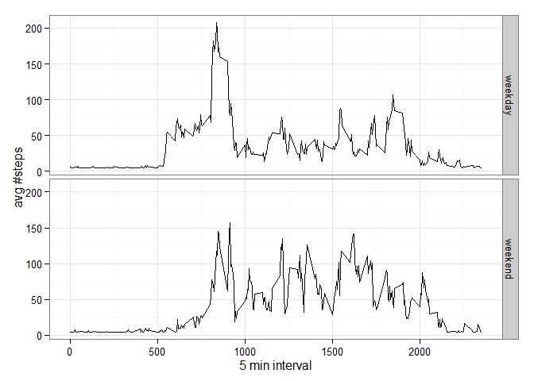

# PA1_template
Sanem S. Sever  
Sunday, May 17, 2015  

This Document States the code and documentation for Programming assignment 1 @ Reproduccible Research Class of Coursera:

First we are asked to load the data:


```r
activity_data<-read.csv('activity.csv')
```
Lets load required libraries:

```
## Loading required package: grid
## Loading required package: lattice
## Loading required package: survival
## Loading required package: Formula
## Loading required package: ggplot2
## 
## Attaching package: 'Hmisc'
## 
## The following objects are masked from 'package:base':
## 
##     format.pval, round.POSIXt, trunc.POSIXt, units
## 
## 
## Attaching package: 'dplyr'
## 
## The following objects are masked from 'package:Hmisc':
## 
##     combine, src, summarize
## 
## The following object is masked from 'package:stats':
## 
##     filter
## 
## The following objects are masked from 'package:base':
## 
##     intersect, setdiff, setequal, union
```
# Assignment Requirements:
## 1. Calculate total steps per day:

```r
daily_step<-activity_data %>%
 group_by(date) %>% 
 summarise_each(funs(sum))
qplot(daily_step$steps,xlab='Total steps per day', ylab='Frequency', geom="histogram") +  theme_bw()
```

 

```r
mean(daily_step$steps,na.rm=TRUE)
```

```
## [1] 10766.19
```

```r
median(daily_step$steps,na.rm=TRUE)
```

```
## [1] 10765
```

## 2. Check the daily average activity pattern:
Calculate daily step means:

```r
interval_step<-activity_data %>%
 group_by(interval) %>% 
 summarise(steps=mean(steps, na.rm = TRUE))
```
Check the daily average activity pattern:

```r
ggplot(interval_step, aes(x=interval, y=steps)) +   
        geom_line(color="green") +  
        labs(title="Avg Daily Activity Pattern", x="Interval", y="#Steps") +  theme_bw()
```

 
find the interval with maximum number of steps:

```r
max_interval <- interval_step[which.max(  
        interval_step$steps),]
```
Interval with the Max Num of steps:**835**
  Max num of steps per interval:**206**
  
## 3. Imputing missing values:
find number of missing values:


```r
missing_values <- sum(is.na(activity_data$steps))
```

count of missing values:**2304**

Strategy for imputing missing values:
use mean of the values:

```r
imputed_activity_data <- activity_data
imputed_activity_data$steps <- impute(activity_data$steps, fun=mean)
```

histogram of the total number of steps taken each day :

```r
Imputed_daily_step <- tapply(imputed_activity_data$steps, imputed_activity_data$date, sum)
qplot(Imputed_daily_step, ,xlab='Total steps per day', ylab='Frequency', geom="histogram") +  theme_bw()
```

 

Imputed mean and median of steps  per day:

```r
mean(Imputed_daily_step)
```

```
## [1] 10766.19
```

```r
median(Imputed_daily_step)
```

```
## [1] 10766.19
```
## 4. weekdays and weekends activity patterns:
Mark Weekdays and Weekends as a new factor variable  with two levels – weekday and weekend


```r
imputed_activity_data$WoD  <-  ifelse(as.POSIXlt(imputed_activity_data$date)$wday %in% c(0,6), 'weekend', 'weekday')
```
Make a panel plot containing a time series plot


```r
averaged_imputed_activity_data <- aggregate(steps ~ interval + WoD, data=imputed_activity_data, mean)
ggplot(averaged_imputed_activity_data, aes(interval, steps)) + 
    geom_line() +  facet_grid(WoD ~ .) +  xlab("5 min interval") +  ylab("avg #steps") +  theme_bw()
```

 
